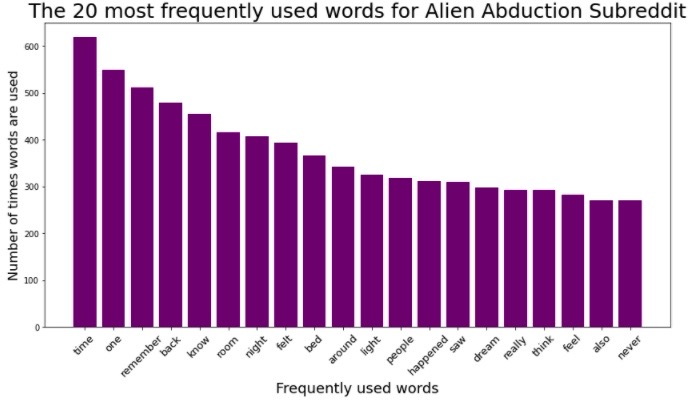
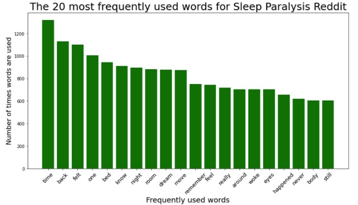
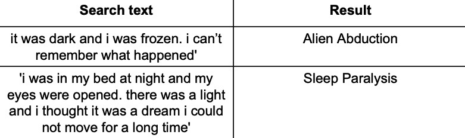

## Project 3
### Reddit NLP and Classification

## Alien Abductions and Sleep Paralysis

Problem Statement:
For years, Aliens have been abducting humans to conduct research on their biology.  Over the years it has become increasingly difficult to catch those wiley creatures off guard. Since humans that have already been abducted do not need to be studied any further, the problem becomes finding ways to abduct new humans.

Executive Summary:
I chose two subreddits based on the topics I chose and how many subscribers there were for each particular one.  I used praw to get the data and I was able to get 1000 posts at a time although neither of my subreddits had that many. Directly after scraping those I wrote them out to csv files so I would not have to scrape them again if I needed to restart my kernel. Then I found the nulls in the data set and filled them with 0s, and I dropped unneeded columns, id, score, url and created. I wrote each cleaned dataset to csv files. I then combined the two dataframes and I converted the subreddit topics to 0 and 1. I then wrote the combined dataset to a csv to use in notebook 2.
I added in a notebook 1.5 where I closely analyzed each dataset individually.  I read in both of the cleaned data sets I created in notebook 1. I created columns for each that listed body length, body word count, title length and title word count. I took those and created distribution plots to compare. I Count Vectorized each dataframe to break everything down and give each word its own column. I was then able to sort out the top words for each individual data frame and create bar charts to show them.

        

In notebook 2 I read in my combined cleaned dataset from notebook 1. I created a custom stop list from words later chosen after looking at coefficients.  Then, I Count Vectorized so all the words used in both subreddits had their own columns.  For my parameters in the vectorizer I my custom stop list as the stop words, min_df=.07, and n-grams=(1,2), then I tranformed the resulting matrix to a dataframe. I used the concat function to combine the vectorized dataframe with my original one.  For my first model I decided to do a Logistic Regression. I defined my X as all the columns that were the vectorized words and my y as the subreddit column.  After that i did a train test split with test size .33 and random_state=42, I fit my model and then got the scores.  My best numbers were .92 for train and .85 for test. My baseline y value counts were .58 and .42. I then found the top 20 words for the combined dataset and made a bar chart.  After that I calculated the mean squared error for both the training and testing models and the were both .49. I then got all the coefficients for the most influential words.  At this point I needed to add several words to my stop list as mentioned above.  I removed any words that were in the titles of my subreddits along with some words that would not help to differentiate the two topics.  After that I created a confusion matrix and calculated the sensitivity and specificity which were .85 and .88 respectively (I did these calculations in the presentation).  For my second model i chose KNN Nearest Neighbors.  I had done Random Forests but my scores kept coming up as 1 and .88 so I couldnt make that work.  I defined my X and y the same and then ran my train test split with parameters: test_size=.25, random_state=42 and stratify y.  After fitting the model, my train and test scores were .8 and .73 respectively. Model testing:

Conclusion:
To succeed in finding humans with sleep paralysis who have not already been abducted, using my model to search will give you the correct results about 92% of the time.

#### cites
https://towardsdatascience.com/scraping-reddit-data-1c0af3040768
https://www.storybench.org/how-to-scrape-reddit-with-python/
https://praw.readthedocs.io/en/latest/getting_started/installation.html
https://www.google.com/search?q=sleep+paralysis&source=lmns&bih=625&biw=981&rlz=1C5CHFA_enUS910US910&hl=en&sa=X&ved=2ahUKEwiftN3HjbzrAhUSYKwKHbhCBvEQ_AUoAHoECAEQAA